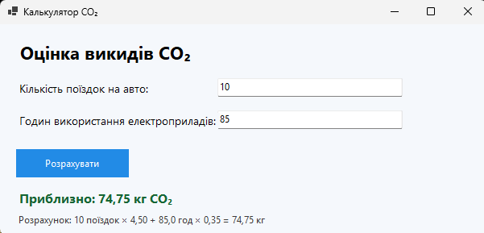

# Звіт про програму CalculatorForm

Програма CalculatorForm призначена для приблизної оцінки викидів CO₂. Користувач вводить кількість поїздок на автомобілі та кількість годин використання електроприладів, після чого програма автоматично розраховує загальний показник викидів за простими коефіцієнтами.

## Екран програми

Детальніший опис функціоналу наведено в [README.md](README.md).
