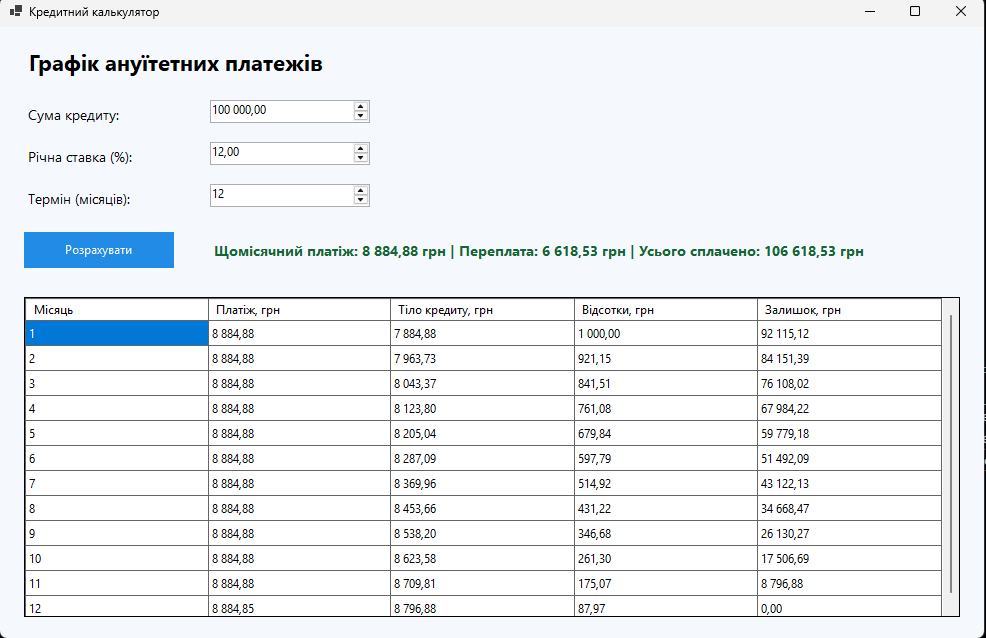

# Кредитний калькулятор

## Короткий опис

`CreditCalculator` — це Windows Forms-застосунок для розрахунку графіка ануїтетних платежів за кредитом.

Користувач вводить:

- суму кредиту;
- річну процентну ставку;
- термін кредиту в місяцях.

Після натискання кнопки **«Розрахувати»** програма обчислює розмір щомісячного платежу та формує повну таблицю виплат у `DataGridView`.

## Функціонал

Для кожного місяця відображаються:

- номер платежу;
- загальна сума платежу;
- частина платежу на погашення тіла кредиту;
- сума нарахованих відсотків;
- залишок кредиту.

Під таблицею програма показує щомісячний платіж, загальну переплату за кредитом і загальну суму виплат. Для кредиту без відсотків також використовується коректний розрахунок рівних платежів.

## Вивід програми

