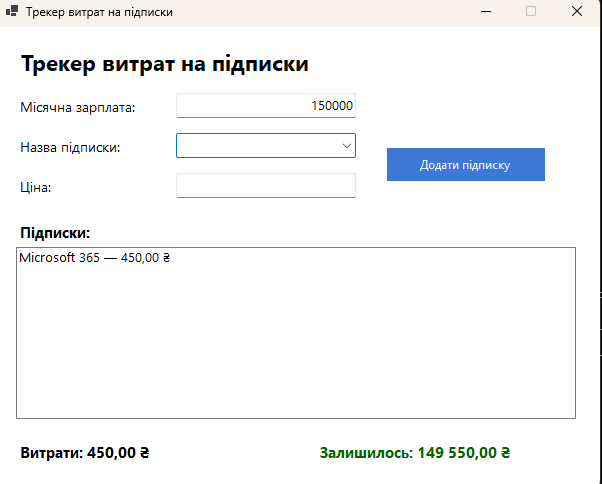

# ExpenseTracker

Проста Windows Forms-програма для обліку підписок та місячного бюджету.

## Функціонал
- Введення місячної зарплати
- Додавання підписки за назвою та ціною
- Вибір готової назви підписки з випадаючого списку або введення власної
- Підрахунок загальних витрат на підписки
- Відображення залишку коштів після витрат
- Показ списку всіх активних підписок

## Вигляд програми

