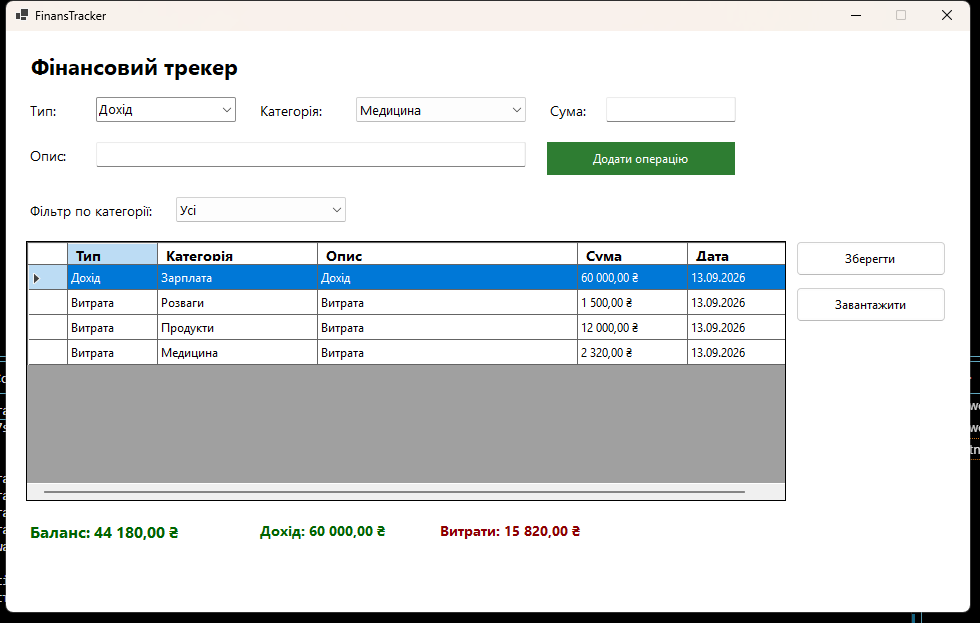

# FinansTracker

Простий Windows Forms-проєкт для обліку доходів і витрат.

## Що вміє
- Додавати операції доходу або витрати
- Вибирати категорію через ComboBox
- Вводити опис і суму операції
- Відображати всі записи у таблиці DataGridView
- Підраховувати баланс, загальний дохід і витрати
- Фільтрувати записи за категоріями
- Зберігати дані у файл і завантажувати їх назад

## Вигляд програми

