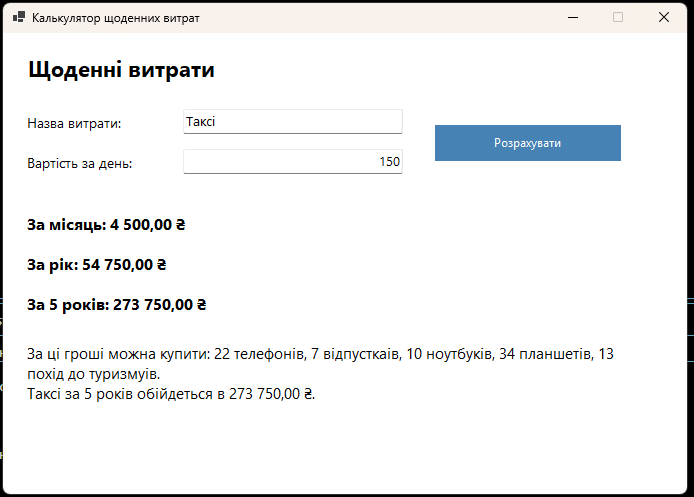

# HabbitsForm

Проста Windows Forms-програма для підрахунку щоденних витрат.

## Що вміє
- Вводити назву витрати, наприклад кава, сигарети або таксі
- Вказувати вартість за день
- Розраховувати витрати за місяць, рік і 5 років
- Порівнювати суму з популярними покупками
- Показувати, що саме можна було б придбати за ці кошти

## Вигляд програми

