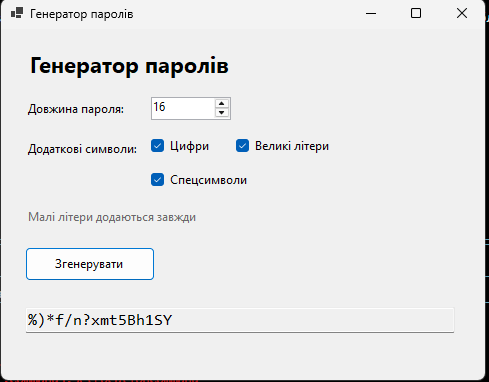

# Звіт по програмі «Генератор паролів»

## Мета роботи

Створити просту Windows Forms програму для автоматичної генерації надійних паролів із заданою довжиною та вибраними типами символів.

## Опис програми

Користувач задає довжину пароля за допомогою поля `NumericUpDown` і вибирає додаткові набори символів:

- цифри;
- великі літери;
- спеціальні символи.

Малі літери додаються до кожного пароля автоматично. Після натискання кнопки **«Згенерувати»** створений пароль відображається в текстовому полі.

## Реалізація

Програма написана для генерації випадкових символів використовується `RandomNumberGenerator`, що забезпечує криптографічно стійку випадковість. Перед заповненням пароля програма додає щонайменше один символ із кожної вибраної категорії, а потім перемішує символи у випадковому порядку.

Довжина пароля може бути від 4 до 128 символів. Якщо вибрати кілька категорій, пароль буде різноманітнішим і складнішим для підбору.

## Вивід програми

На зображенні показано вікно програми з довжиною пароля 16 символів, вибраними цифрами, великими літерами та спеціальними символами, а також згенерованим паролем.