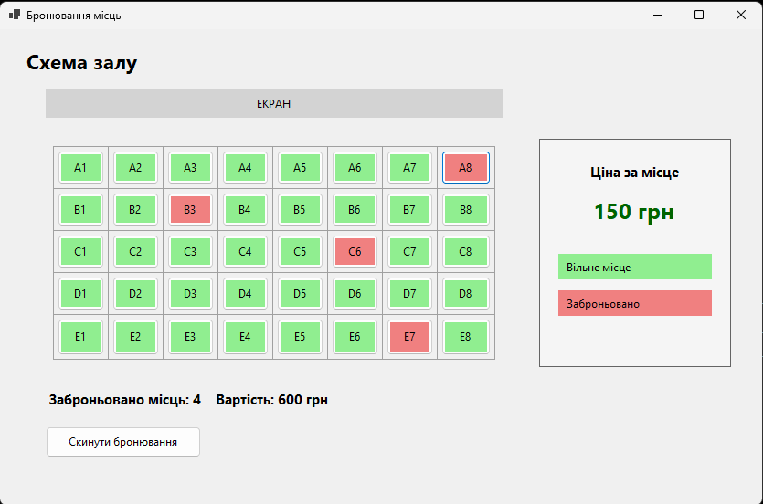

# Звіт по програмі «Бронювання місць»

## Мета роботи

Створити Windows Forms програму для вибору та бронювання місць у залі з візуальним відображенням їхнього статусу й автоматичним підрахунком вартості.

## Опис програми

На формі розміщена схема залу у вигляді сітки 5×8. Кожне місце представлено окремою кнопкою з позначенням ряду та номера.

Після натискання на кнопку місце змінює статус:

- зелене місце — вільне;
- червоне місце — заброньоване.

У правій частині форми відображається ціна одного місця — **150 грн**. Унизу програма показує кількість заброньованих місць і загальну вартість бронювання. Кнопка **«Скинути бронювання»** повертає всі місця у вільний стан.

## Реалізація

В програмі для розміщення кнопок використано `TableLayoutPanel`, а статус місця зберігається у властивості `Tag` кнопки. Після кожного натискання метод оновлення підраховує кількість заброньованих місць і множить її на ціну одного місця.

## Вивід програми

