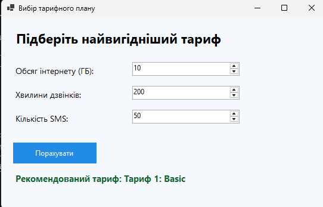

# Вибір тарифного плану

## Короткий опис

`SelectForm` — це навчальний Windows Forms-застосунок мовою C#, який допомагає підібрати тарифний план мобільного оператора відповідно до потреб користувача.

Користувач вказує:

- обсяг мобільного інтернету в гігабайтах;
- кількість хвилин для дзвінків;
- кількість SMS-повідомлень.

Після натискання кнопки **«Порахувати»** програма порівнює введені значення з умовами тарифів і виводить рекомендований варіант.

## Алгоритм роботи

Програма послідовно перевіряє введені параметри:

| Умови | Рекомендований тариф |
|---|---|
| До 10 ГБ, 300 хвилин і 100 SMS | Тариф 1: Basic |
| До 20 ГБ, 800 хвилин і 500 SMS | Тариф 2: Standard |
| До 40 ГБ, 1500 хвилин і 1000 SMS | Тариф 3: Plus |
| Значення, що перевищують попередні межі | Тариф 4: Unlimited |

## Вивід програми

Форма містить заголовок, три поля числового введення, кнопку розрахунку та напис із результатом.

На зображенні наведено приклад роботи програми з параметрами 10 ГБ інтернету, 200 хвилинами дзвінків і 50 SMS. Для таких значень рекомендовано тариф **Basic**.