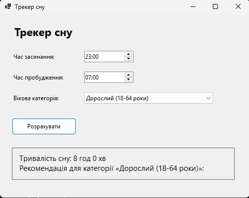

# Звіт по програмі «Трекер сну»

## Мета роботи

Створити Windows Forms програму, яка визначає тривалість сну користувача та порівнює її з рекомендованим діапазоном для вибраної вікової категорії.

## Опис програми

Користувач указує:

- час засинання;
- час пробудження;
- вікову категорію: дитина, підліток, дорослий або старший дорослий.

Після натискання кнопки **«Розрахувати»** програма обчислює тривалість сну та виводить одну з рекомендацій: **норма**, **недосип** або **пересип**.

## Реалізація

Програма написана для відслідковування сну. Для введення часу застосовано два елементи `DateTimePicker`, а для вибору вікової категорії — `ComboBox`. Якщо час пробудження не пізніший за час засинання, програма враховує перехід через опівніч.

Рекомендовані діапазони тривалості сну:

- дитина: 9–12 годин;
- підліток: 8–10 годин;
- дорослий: 7–9 годин;
- старший дорослий: 7–8 годин.

## Вивід програми

